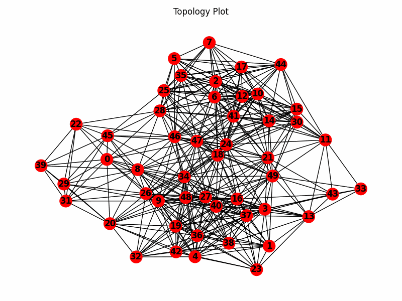
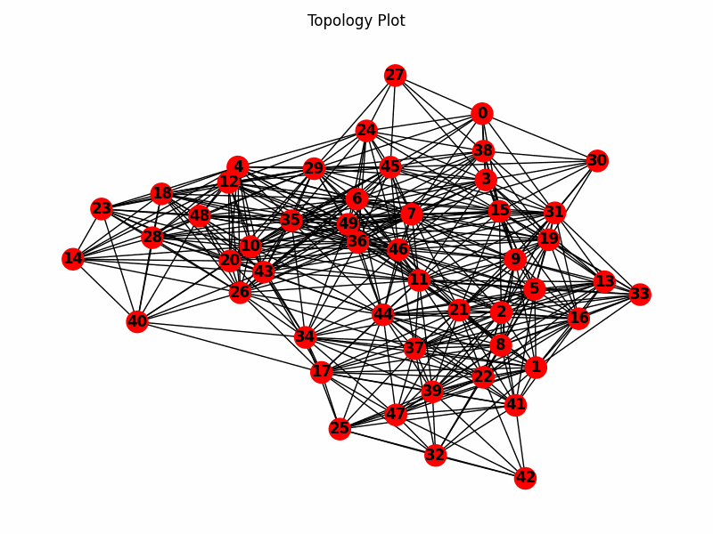

# OLSR

## Abstract

The Optimized Link State Routing (OLSR) protocol enhances traditional link state routing for mobile ad hoc networks by utilizing multipoint relays (MPRs). These special nodes are selected to reduce the overhead associated with widespread broadcasting. By employing MPRs, OLSR reduces broadcast repetitions by approximately 95%, from 17,784 in basic broadcasting down to just 971.

In OLSR, only MPRs transmit link state information, focusing on their direct connections rather than the entire network. This selective approach not only minimizes the volume of control messages but also enhances the efficiency of data distribution, aiding in the calculation of more accurate and optimal routing paths. My findings show that OLSR adapts effectively to changing network topologies, often delivering near-optimal routing results.

However, the protocol faces stability challenges due to its operation without full knowledge of the actual network topology, which can sometimes result in sub-optimal routing decisions. Despite these limitations, OLSR proves highly effective in large and dense networks, making it a robust choice for future mobile wireless LANs due to its significant reduction in broadcast overhead and ability to maintain route accuracy.

## OLSR Implementation

This project implements the Optimized Link State Routing (OLSR) protocol using the Ad Hoc Computing framework. OLSR is a proactive routing protocol designed for mobile ad hoc networks (MANETs).

#### Files

- OLSR.py: The main file containing the OLSRComponent class which represents an OLSR node. It handles message processing, neighbor discovery, MPR selection, and routing table calculation.
- message_types.py: Defines the message types used in the OLSR protocol, including HelloMessage, TCMessage, and a generic Message class.
- enums.py: Contains enum classes for OLSR event types (OLSREventTypes) and willingness levels (Willingness).
- helpers.py: Provides helper functions for plotting the topology and saving/visualizing the state of the topology.

To run the OLSR implementation:

1. Ensure you have the required dependencies installed, including the Ad Hoc Computing framework and NetworkX.
2. Run the main function in OLSR.py, specifying the desired number of nodes:
```
if __name__ == '__main__':
    main(50)
```
This will create a random geometric graph with the specified number of nodes and run the OLSR protocol on the topology.
3. The topology plot will be saved in the plots directory, showing the MPR selection status of each node (blue for MPR, red for non-MPR, green for one-hop neighbors of MPRs).

#### Configuration

You can configure the OLSR parameters by modifying the set_parameters method in the OLSRComponent class:

- hello_interval: The interval for sending Hello messages (default: 2 seconds).
- tc_interval: The interval for sending TC messages (default: 5 seconds).
- willingness: The willingness of the node (default: Willingness.WILL_DEFAULT).

#### Functionality

The OLSR implementation includes the following key functionalities:

- Neighbor discovery: Nodes periodically send Hello messages to discover their one-hop neighbors and maintain the neighbor set.
- MPR selection: Nodes select a set of Multi-Point Relays (MPRs) based on the OLSR protocol to minimize the number of broadcast retransmissions.
- Topology control: Nodes exchange TC messages to propagate the topology information and build the known topology.
- Routing table calculation: Each node calculates its routing table based on the known topology using Dijkstra's shortest path algorithm.
- Message forwarding: Nodes forward data packets according to their routing tables, dropping packets if no route is found.

#### Visualization

The implementation includes functionality to visualize the topology and the MPR selection status of nodes. The plot_topology function in helpers.py is used to plot the topology, with blue nodes representing MPRs, red nodes representing non-MPRs, and green nodes representing one-hop neighbors of MPRs.

The TopologyStateSaver class in helpers.py allows saving and visualizing the state of the topology over time. It can produce a GIF animation of the saved states.

#### Dependencies

adhoccomputing 
NetworkX
Matplotlib
PIL (Python Imaging Library) - required for creating GIF animations

#### Notes

- The implementation assumes a single interface for each node.
- The consume method in the OLSRComponent class is a placeholder for consuming incoming data packets and can be customized as needed.
- Error handling and logging are included in the implementation for debugging and monitoring purposes.

#### Some Results

Here's how the implementation performs for various experiments:

1. Here's how OLSR converges:



2. Number of repetitions for broadcasting

The OLSR implementation significantly reduces the number of repetitions for broadcasting compared to basic broadcasting. Here are the results for various experiments:

These results demonstrate the effectiveness of OLSR in reducing broadcast overhead and improving efficiency in mobile ad hoc networks.


3. Here's how the algorithm reacts to some disturbance to the connections:

