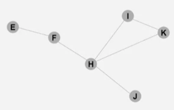

.. include:: substitutions.rst

|DistAlgName|
=========================================

The Optimized Link State Routing (OLSR) algorithm is a proactive routing protocol designed for mobile ad hoc networks (MANETs). It aims to establish and maintain routes between nodes in a dynamic and decentralized network environment. OLSR achieves this by periodically exchanging topology information among neighboring nodes, enabling efficient route discovery and maintenance.

OLSR operates on the principle of using hello and topology control (TC) messages to discover and then disseminate link state information throughout the mobile ad-hoc network. The key concept in OLSR is the use of MultiPoint Relays (MPRs). These are selected nodes which forward broadcast messages during the flooding process. This technique significantly reduces the number of retransmissions in a broadcast procedure.

Key Features of OLSR:

**Topology Discovery:** OLSR discovers the network topology by periodically exchanging information about the presence and quality of links between nodes.

**Multipoint Relays (MPRs):** Each node selects a subset of its one-hop neighbors, called Multipoint Relays (MPRs), to forward its link state information. This reduces the overall number of transmissions required to disseminate the link state information throughout the network.

**Partial-Route Sets:** Nodes only propagate partial information about their neighbors, reducing the size of link state updates.

**Message Types:** OLSR defines two types of messages:

- **Hello messages:** Used for neighbor discovery and maintenance. Nodes periodically broadcast Hello messages to their one-hop neighbors.
- **Topology Control (TC) messages:** Used for distributing link state information. Nodes send TC messages containing partial-route sets to their MPRs.

**Routing Table Computation:** Nodes compute their routing tables based on the received link state information, using the Dijkstra's Algorithm or a similar method.
   
    .. _OptimizedLinkStateRoutingAlgorithm:

    .. code-block:: RST
        :linenos:
        :caption: |DistAlgName|

        dict NeighborTable;
        set MPRSet;
        dict RoutingTable;
        int SequenceNumber;
        bool CurrentNodeIsMPR;
        int Willingness;

        Procedure InitializeOLSRForNode
        NeighborTable ← empty;
        MPRSet ← empty;
        RoutingTable ← empty;
        SequenceNumber ← 0;
        Start HelloMessageScheduler;
        Start TCMessageScheduler;

        Procedure HelloMessageScheduler
        while true do
            wait HelloInterval;
            Perform SendHelloMessage;
        end while

        Procedure TCMessageScheduler
        while true do
            wait TCInterval;
            if CurrentNodeIsMPR = true then
                Perform SendTCMessage;
            end if
        end while

        Procedure SendHelloMessage
        Message HelloMsg ← new(Type: "Hello", Neighbors: keys(NeighborTable), Willingness: Willingness);
        Perform Broadcast(HelloMsg) to all immediate neighbors;

        Procedure SendTCMessage
        Increment SequenceNumber by 1;
        Message TCMsg ← new(Type: "TC", MPRSelectors: MPRSet, SeqNum: SequenceNumber);
        Perform Broadcast(TCMsg) through MPRs to entire network;

        Procedure ReceiveMessage(Message msg)
        if msg.Type = "Hello" then
            Perform ProcessHelloMessage(msg);
        else if msg.Type = "TC" then
            Perform ProcessTCMessage(msg);
        end if

        Procedure ProcessHelloMessage(Message HelloMsg)
        Update NeighborTable with HelloMsg.Sender, HelloMsg.Neighbors and HelloMsg.Willingness;
        Perform UpdateMPRSet;

        Procedure ProcessTCMessage(Message TCMsg)
        if TCMsg.SeqNum > RoutingTable[TCMsg.Sender].SeqNum then
            Update RoutingTable with TCMsg.Sender, TCMsg.MPRSelectors, and TCMsg.SeqNum;
        end if

        Procedure UpdateMPRSet
        Set NewMPRSet ← SelectMPRs(NeighborTable);
        if MPRSet ≠ NewMPRSet then
            MPRSet ← NewMPRSet;
            Trigger TCMessageScheduler immediately;
        end if

        Procedure SelectMPRs(Dict NeighborTable)
        Set MPRCandidates ← empty;
        Sort NeighborTable by Willingness;
        foreach Neighbor in NeighborTable do
            if Neighbor qualifies as MPR then
                Add Neighbor to MPRCandidates;
            end if
        end foreach
        return MPRCandidates;

        Procedure OLSRMainLoop
        Perform InitializeOLSRForNode;
        while true do
            Message msg ← Listen for incoming messages;
            if msg received then
                Perform ReceiveMessage(msg);
            end if
        end while

Example
~~~~~~~~

Let's consider a simple example to illustrate the operation of OLSR in a small ad hoc network. In this example, we have six nodes (E, F, H, I, K, J) with the following links between them:

    Figure: Simple Example [1]_

.. [1] Source: https://www.coursera.org/lecture/iot-communications/lecture-10-optimized-link-state-routing-olsr-KCCe6

MPR Selection: Each node selects a set of nodes from its one-hop neighbors that can reach its two-hop neighbors. This set is the smallest set that covers all two-hop neighbors. The nodes in this set are called Multipoint Relays (MPRs).

Dissemination of Topology Information: Each node with selected MPRs will then declare this information in its control messages. MPRs will forward these control messages, thus reducing the number of retransmissions.

To illustrate this in a simple way, I will enumerate the one-hop and two-hop neighbors and determine the MPRs for each node:

**Node E:**

One-hop neighbors: F
Two-hop neighbors: H
MPRs for E: F (since F can reach H)

**Node F:**

One-hop neighbors: E, H
Two-hop neighbors: I, K, J
MPRs for F: H (since H can reach all of F's two-hop neighbors)

**Node H:**

One-hop neighbors: F, I, K, J
Two-hop neighbors: E (through F), I (through K)
MPRs for H: F (F can reach E)

**Node I:**

One-hop neighbors: H, K
Two-hop neighbors: F, J (both through H)
MPRs for I: H (since H can reach F and J)

**Node K:**

One-hop neighbors: H, I
Two-hop neighbors: F, J (both through H)
MPRs for K: H (since H can reach F and J)

**Node J:**

One-hop neighbors: H
Two-hop neighbors: F, I, K (all through H)
MPRs for J: H (since H can reach F, I, and K)

**Routing Table Calculation:**

After MPRs are selected, each node can construct its routing table by using the information from the Hello and TC messages. The Hello messages contain information about the one-hop neighbors, while the TC messages contain information about links between MPRs and their selectors.

Correctness
~~~~~~~~~~~

Loop-Free Routing: OLSR ensures loop-free routing at all times by using sequence numbers in TC messages, which prevents the formation of routing loops.

Eventual Consistency: The periodic exchange of messages guarantees that, eventually, all nodes will have consistent information about the network topology, assuming a stable network.

Complexity 
~~~~~~~~~~

Time Complexity of MPR Selection:
The time complexity of MPR selection is O(N^2) in the worst case, where N is the number of nodes in the network. However, in practice, the time complexity of MPR selection is much lower due to the sparsity of the network and the use of heuristics to select MPRs.

The computational complexity of OLSR is primarily determined by the shortest path algorithm used to calculate routes. In OLSR, Dijkstra's algorithm is typically employed, which has a time complexity of O(N^2) in the worst case, where N is the number of nodes in the network. However, in sparse networks, the complexity can be reduced to O(N log N) using Fibonacci heaps or other optimized data structures.

The message complexity of OLSR depends on the network topology, the number of nodes, and the density of the network. In the worst-case scenario, each node may have to send link state advertisements (LSAs) to all its neighbors, resulting in a message complexity of O(N^2), where N is the number of nodes in the network. However, due to the use of Multi-Point Relays (MPRs), the actual message complexity is significantly lower in most cases.