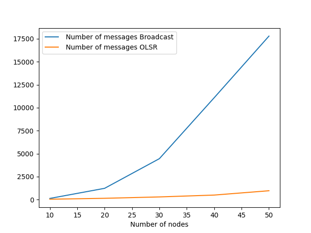

.. include:: substitutions.rst

Implementation, Results and Discussion
======================================

Implementation and Methodology
~~~~~~~~~~~~~~~~~~~~~~~~~~~~~~~~~~~~

The study utilized a simulation-based experimental research methodology using the adhoccomputing library, a Python framework designed for simulating ad hoc networks. This approach allowed for controlled manipulation of network parameters and behaviors to observe the effects on the Optimized Link State Routing (OLSR) protocol. The study is original in its specific application and manipulation of network conditions, particularly in how node connections were dynamically altered to simulate mobility.

The OLSR implementation is composed of several main components: 

OLSRComponent : This is the main component that represents an OLSR node in the network and extends the GenericModel class provided by the adhoccomputing library. It maintains a neighbor set, a topology table and a routing table and handles all events of type HELLO messages, TC (Topology Control) messages and message forwarding.

HelloMessage and TCMessage : These are custom message classes representing HELLO and TC messages in the OLSR protocol. They extend the GenericMessage class and contain message source, destination and payload.

OLSREventTypes : It is an enumeration that defines event types used by the OLSR implementation. These include HELLO and TC events. 

The OLSRComponent initializes timers for periodically sending HELLO and TC messages. When a HELLO message is received, the component updates its neighbor set with the information about the one-hop neighbor. When a TC message is received, the component updates its topology table with the topology information received from other nodes.

The OLSR protocol uses a method called Multi-Point Relays (MPRs) to decrease the burden of transmitting topology information everywhere. Every node selects a group of MPRs from its one-hop neighbors so that these MPRs cover all their two-hop neighbors. The select_mpr function in the OLSRComponent applies the MPR selection algorithm by using two-hop neighbor details.

The OLSRComponent's calculate_routing_table method is responsible for computing the routing table according to the present topological info. It uses Dijkstra's algorithm in order to determine shortest paths towards every accessible node within network.

The send_hello, send_tc, on_hello and on_tc functions are managing the sending and receiving of HELLO and TC messages. The on_else function is responsible for forwarding messages to the next hop, decided by the routing table.

There were 2 measurements taken in this study:

**Repetitions for broadcasting:** a total of 5 broadcast messages were sent from the 0th node of the network, and the number of repetitions was counted. This provided a basic understanding of how the OLSR protocol disseminates information through the network. This is a quantitative measure of the efficiency of the protocol in terms of message dissemination.

**Mobility Emulation:** the adhoccomputing framework does not inherently provide a method to model mobility. To simulate mobility, connections between arbitrary nodes were actively removed and added based on a probability factor. This allowed the OLSR algorithm to dynamically adapt to the changing network topology on the fly. This is a qualitative measure of the efficiency of the protocol in terms of adapting to changing network conditions.

Visualization of the OLSR protocol in action was achieved by collecting instances at each MPR selection. While the timing of the animations may not be perfectly accurate due to the potential for (near) simultaneous MPR selections, this approach still provided valuable insights into the workings of the algorithm.

Results
~~~~~~~~

Due to the limitations of the rst format, the figures demonstrating the OLSR algorithm's convergence and adaptability to topology changes cannot be directly embedded in this document. I apologize for any inconvenience this may cause. To ensure that you can still view these important visualizations, I will provide direct links to the gif files.

OLSR Convergence
----------------

Figure 2 illustrates the convergence process of the OLSR algorithm. In the animation, red points represent uncovered nodes, blue points represent MPR (Multi-Point Relay) nodes, and green points represent covered nodes. As the algorithm progresses, you can observe how the network converges, with more nodes turning green as they become covered by the MPRs. This visualization provides a clear understanding of how the OLSR algorithm efficiently selects MPRs to cover the entire network.

Link to Figure 2: https://s12.gifyu.com/images/SaIb0.gif

The timesteps of the animation is not actually time steps, but the flooding of the topology control message. By its nature, the OLSR algorithm converges at only one Topology Control flood. This is because the MPR selection process ensures that every node has a set of MPRs that cover all two-hop neighbors. This property is crucial for minimizing the overhead associated with broadcasting messages in the network. In some occasions, the algorithm may converge in two Topology Control floods, but this is rare and depends on the network topology, and the arbitrary changes that happens within the concurrences. 

Broadcast Message Repetition
----------------------------

To quantitatively assess the performance of the OLSR algorithm, I conducted a study comparing the number of broadcast messages required for a simple broadcast and the OLSR algorithm. The data collected is presented in the following table:

.. raw:: latex

    \begin{table}[h]
    \centering
    \begin{tabular}{|c|c|c|}
    \hline
    Number of nodes & Number of messages (Simple Broadcast) & Number of messages (OLSR) \\
    \hline
    10 & 135 & 50 \\
    \hline
    20 & 1234 & 150 \\
    \hline
    30 & 4460 & 299 \\
    \hline
    40 & 11082 & 501 \\
    \hline
    50 & 17784 & 971 \\
    \hline
    \end{tabular}
    \caption{Comparison table of broadcast messages required for simple broadcast and OLSR algorithm}
    \end{table}

Figure 3 presents a visual representation of this data, clearly demonstrating the significant reduction in the number of broadcast messages required by the OLSR algorithm compared to a simple broadcast. As the number of nodes in the network increases, the difference between the two approaches becomes more pronounced, highlighting the scalability and efficiency of the OLSR algorithm.

.. raw:: latex

    \begin{figure}[H]
    \setcounter{figure}{2}

     Repetitions Comparison

.. raw:: latex

    \end{figure}

Adaptability to Topology Changes
--------------------------------

Figure 4 demonstrates the adaptability of the OLSR algorithm to topology changes. In this animation, I actively removed and added connections between arbitrary nodes with a certain probability, allowing the OLSR algorithm to adjust on the fly. The visualization shows how quickly the algorithm can adapt to these changes, maintaining network coverage and efficiency.

Link to Figure 4: https://s12.gifyu.com/images/SaIbC.gif

Discussion
~~~~~~~~~~

The results obtained from this study provide valuable insights into the performance and adaptability of the OLSR algorithm in mobile ad-hoc networks. The quantitative data collected, as shown in the table and Figure 3, clearly demonstrates the significant reduction in the number of broadcast messages required by the OLSR algorithm compared to a simple broadcast. This finding supports the hypothesis that the OLSR algorithm improves network efficiency by minimizing the overhead associated with message broadcasting.

The data analysis reveals that as the number of nodes in the network increases, the OLSR algorithm's performance advantage becomes more evident. This scalability is a crucial aspect of the algorithm, as it ensures that the network can grow without compromising efficiency. The quantitative nature of the data allows for a clear and measurable comparison between the two broadcasting methods, providing a strong foundation for the conclusions drawn from this study.

The qualitative analysis of the OLSR algorithm's adaptability to topology changes, as illustrated in Figure 4, highlights another essential aspect of its performance. The animation demonstrates how quickly the algorithm can adjust to changes in the network structure, maintaining coverage and efficiency despite the dynamic nature of the environment. This adaptability is vital for mobile ad-hoc networks, where nodes may frequently join, leave, or move within the network.

While the approach used in this study to model mobility by actively manipulating connections between nodes serves as a valid proof-of-concept, it is important to acknowledge its limitations. This method may not fully capture all aspects of real-world mobility scenarios, and further research using more advanced mobility models could provide additional insights into the algorithm's performance under various conditions.

Despite these limitations, the results obtained from this study strongly support the hypothesis that the OLSR algorithm is an efficient and adaptable solution for routing in mobile ad-hoc networks. The significant reduction in broadcast messages and the algorithm's ability to quickly adjust to topology changes demonstrate its potential for improving network performance and reliability.

